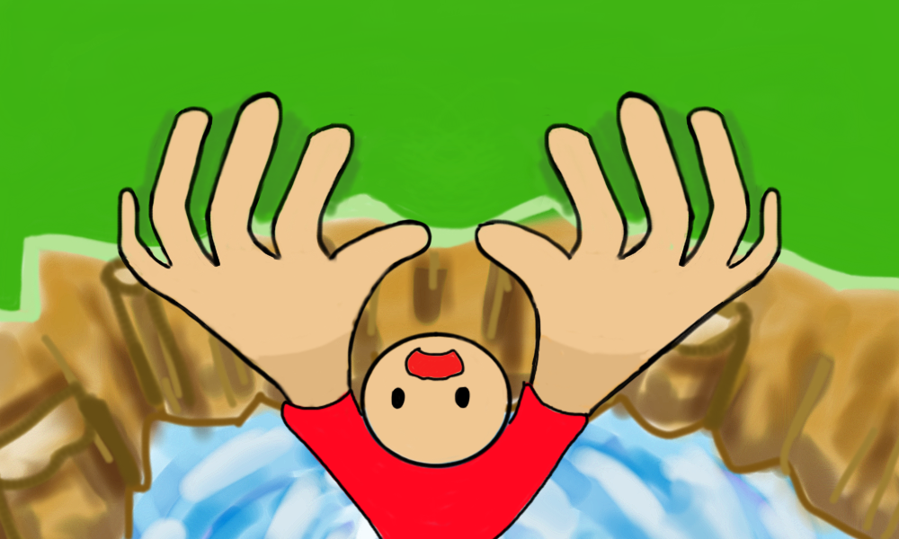

# Cliffhanger

In this game, the player hangs from a cliff. The objective of the game is to hang on as long as possible while trying to avoid getting hit by a hammer. 

A "reverse whack-a-mole" game, players hold the ASD and JKL keys and lift their fingers when the hammer attempts to hit them.

Made in 2015, in ICS3U1-01 (Eleventh Grade Computer Science), for Mr. D. Cope.
Written in Pygame, Python 2.7 by Jessica Ip and Pamela Zeng.

